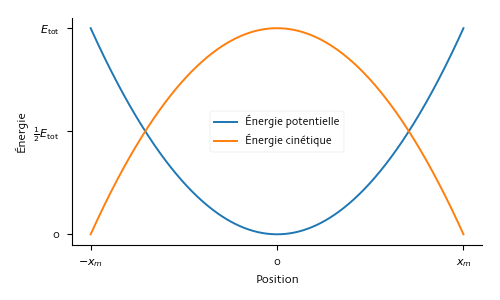
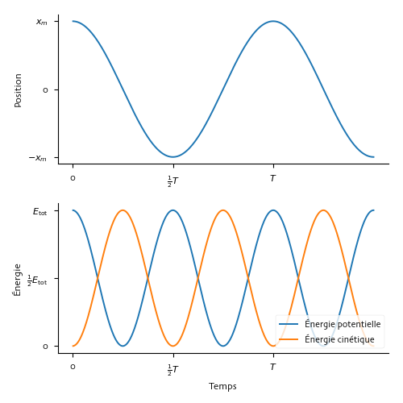

# Oscillations

## Exercices {-}

En classe, nous travaillerons sur les exercices des [diapositives 
suivantes](https://docs.google.com/presentation/d/1K3wUYffcH0Q8pshmT-csSTZUmDQt0aj7my9UdrElOso/edit?usp=sharing).

## Résumé des définitions

Mouvement harmonique simple (MHS)
: Mouvement de va et vient autour d'une position d'équilibre causé par une 
force dont la grandeur est proportionnelle à la distance par rapport au point 
d'équilibre et la direction est toujours vers le point d'équilibre. La position 
en fonction du temps est décrite par une fonction sinusoïdale, par exemple :
\begin{equation}
  x = x_m \cos(\omega t + \phi).
  (\#eq:mhs)
\end{equation}

Amplitude
: Distance maximale entre la position d'équilibre et l'objet en mouvement 
harmonique simple. Elle est représentée par $x_m$ dans l'équation 
\@ref(eq:mhs).

Phase
: Argument de la fonction sinusoïdale qui décrit un mouvement harmonique 
simple, i.e. : $\omega t + \phi$ dans l'équation \@ref(eq:mhs).

Constante de phase
: Constante dont la valeur est fixée par les conditions initiales du mouvement 
harmonique simple. Elle est représentée par $\phi$ dans l'équation 
\@ref(eq:mhs).

Fréquence angulaire
: Nombre de radians par lequel la phase d'un mouvement harmonique simple 
augmente chaque unité de temps. Elle est représentée par $\omega$ dans 
l'équation \@ref(eq:mhs).

Fréquence
: Nombre d'aller-retour qu'un objet en mouvement harmonique simple effectue par 
unité de temps. La fréquence $f$ est reliée à la fréquence angulaire par
$$f = \frac{\omega}{2\pi}$$
puisque un aller-retour correspond à une variation de phase de $2\pi$ radians.

Période
: Durée d'un aller-retour dans un mouvement harmonique simple. La période, $T$, 
est l'inverse de la fréquence donc
$$T = \frac{1}{f} = \frac{2\pi}{\omega}.$$

## Évolution temporelle d'un MHS

  

  

  

$x(t) =$  $\cos($ $t +$
$)$

$v_x(t) = -$  $\sin($ 
$t +$ $)$

$a_x(t) = -$  $\cos($ 
$t +$ $)$

$x_m$
<input id="xm" type="range" min="0" max="5" step="0.1" style="width: 120px;">
 
$\omega$
<input id="w" type="range" min="0" max="10" step="0.1" style="width: 120px;">
 
$\phi$
<input id="phi" type="range" min="-10" max="10" step="0.1" style="width: 120px;">

## Système bloc-ressort

Dans le cas d'un système composé d'un bloc de masse $m$ et d'un ressort dont la 
constante de rappel est $k$, la fréquence angulaire des oscillations du bloc 
est donnée par
$$\omega = \sqrt{\frac{k}{m}}.$$

## Énergie dans un système bloc ressort

Le graphique suivant montre comment l'énergie potentielle et l'énergie 
cinétique varient selon la position du bloc.

La variation d'énergie potentielle et d'énergie cinétique est deux fois plus 
rapide que la variation de position. C'est ce qui est illustré dans les 
graphiques suivants.

